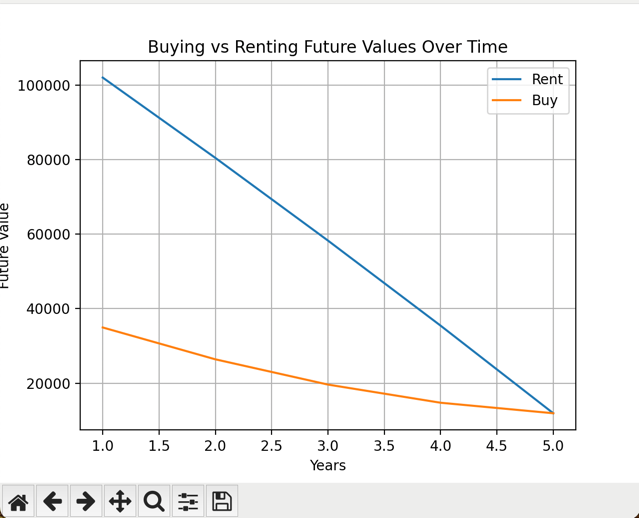
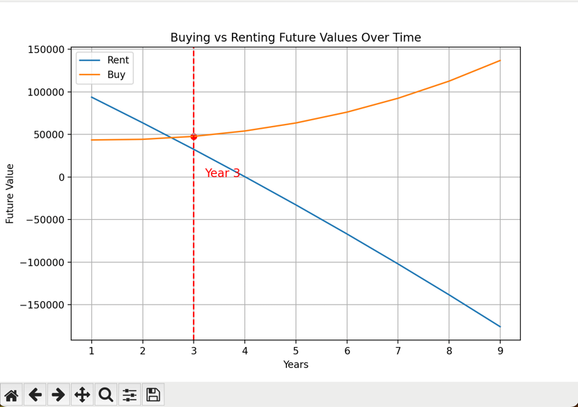

find_rent_price_intersection.py allows you to find what rent is about equal to buying in terms of return for a given number of parameters when considering a bunch of parameters (interest_rate, property price, downpayment, investment return percentage, service charge etc).

Example run output:
Console:
```commandline
                          Metric                           Value
0              Total Buying Cost                    125234.03962
1             Total Renting Cost                   152672.578423
2         Total Buy Future Value                    11928.773483
3        Total Rent Future Value                    11929.167622
4     Future Value of Investment                   164601.746045
5   Future Value of Rent Savings                             0.0
6    Future Value of Buy Savings                    30986.951535
7          Future Property Value                   457913.259349
8             Current rent price                     2790.850894
9       Monthly mortgage payment                        1351.875
10    Total Monthly Buying Costs                     2087.254203
11                    Difference                        0.394139
12                      Decision  Renting is better than buying.
Minimum rent to justify property price given parameters: 2320.528030395508
```

Image:



example.py just plays the parameters of a given rent vs buy simulation for as long as specified, prints out stats like the final difference and a graph showing each year.
Console:
```commandline
                          Metric                           Value
0              Total Buying Cost                   225422.241345
1             Total Renting Cost                   383713.267844
2         Total Buy Future Value                   136871.749967
3        Total Rent Future Value                  -175907.355886
4     Future Value of Investment                   207805.911957
5   Future Value of Rent Savings                             0.0
6    Future Value of Buy Savings                   200370.145928
7          Future Property Value                   515385.407613
8             Current rent price                     4182.066385
9       Monthly mortgage payment                        1351.875
10    Total Monthly Buying Costs                     2087.254203
11                    Difference                   312779.105853
12                      Decision  Buying is better than renting.
```

Image:
